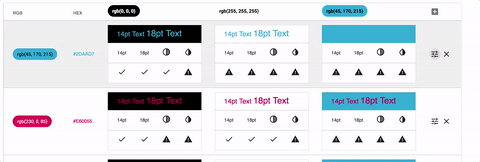
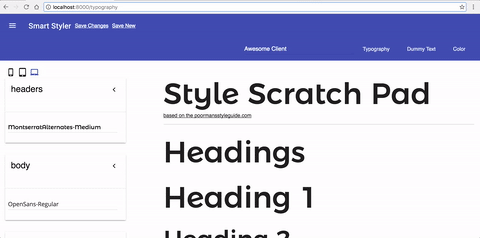

# Style Scratch Pad

The Style Scratch Pad is meant to be used as an intra-agency playground for trying out various typographic and color combinations. It will test given foreground and background colors for WCAAG2 AA compliance. It will also generate shareable urls that allow other users to import your settings in their list of styles.

[Demo](https://stylescratchpad.firebaseapp.com/)

## Features

### Color Combinations
In the color tab, you can add/remove color swatches by providing any valid css syntax to the entry field. However, the final value gets saved as RGB.

From left to right, the values are:

1. Legibility at 14pt font-size
2. Legibility at 18pt font-size
3. General Color Contrast
4. General Color Difference (to determine variance for semantic meaning)

*Note: It is possible to have AA passing legible color combinations and be failing any or all of the color contrast / color difference settings. It depends on if you intend for the user to understand something special based on the color used or simply be able to read the text.*

The settings button drops down an array of sliders for controlling the rgb values as well as helpers to darken and lighten the value as a whole. All data entries ca be edited in-line.

### Typographic Combinations
By default, an array of the most common HTML elements is provided for your styling pleasures. hTags, Blockquotes, Li's - the whole party. This can be customized by adding new elements to the `baseFontElements` array in `src/index.js`. All the data in the `src/index` folder is passed to Redux on launching the app to prefill the application state. You can find **colors**, **Type Settings** and **Fonts** in this file. The fonts initially provided are a random assortment from Google Fonts for demonstration purposes. The type field acts as a fuzzy search for the provided fonts but will validate a manually typed local, system font as well.

### Saved copies of working styles

The saved styles feature is accomplished by using the localstorage api. At no point does any data get stored on a server. If you prefill a hosted version of the app with your secret type and color combinations, that WILL be available on a server. If you send the url to someone, it would be possible for someone to intercept that string, decode the data parameter and see what you sent, so, user beware!

### Local Hosting
If you want, the library is entirely capable of being self-hosted. Simply clone the repository, run `npm install` to save the dependencies, and `npm start` to run a local server. Node.js > 6 is required

### Self Hosting
You can also host your own. Run `npm dist` to build out any changes to the webapp and you know have an SPA ready website in your `/dist` folder. I highly recommend the awesome [Firebase hosting](https://firebase.google.com/docs/hosting/).

**To host with Firebase:**
1. Download the firebase tools with `npm install --save -g firebase-tools`
2. Run `firebase init` at the root of your project.
3. It will open a browser instance to authenticate a free account for you.
4. Follow the in-Terminal promps and deselct "database" from the services you want to use. If you aren't familiar with selecting options in Terminal, simply arrow down to the line you want to remove and prese `spacebar`.
5. Run `firebase deploy` - that's it! It's a fantastically thought out workflow! Kudos @Firebase!

## The Tech Stack & Contributing
Behind the scenes the app is built with the [generator-react-webpack](https://github.com/react-webpack-generators/generator-react-webpack) [Yeoman](http://yeoman.io/) package.

> If you aren't already using Yeoman, you are missing out. I highly recommend heading over to the homepage and read about the power of app scaffolding. Keystrokes saved!

It utilizes React, Redux, React-Router, CSS Modules and Webpack for the general build process. The javascript is written in ES2015 and is transpiled with Babel. If those all sound like your thing, feel free to extend, fix and make pull requests!

The UX was a victim of feature creep of a small in-house tool that blew out of proportion. If you have a passionate idea how to improve the workflow, pull-requests for these issues are also welcomed!

## Todo
- [ ] Write unit tests
- [ ] Add better comments
- [ ] Clean up code style
- [ ] Impliment Google Fonts API?
- [ ] Add test > deploy workflow with NPM Scripts

